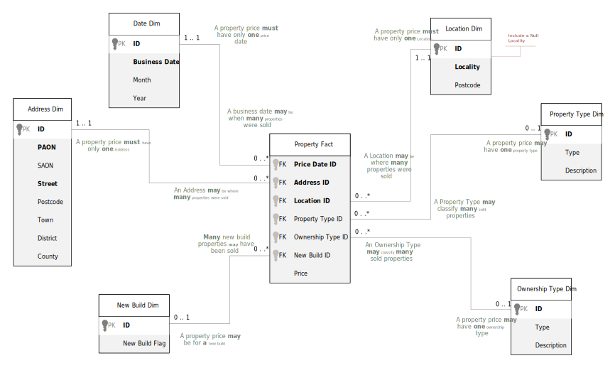

## UK Property: Prices Paid Data (PPD)
The UK Property Prices Paid dataset published by the UK Land Registry requires just a simple design for an Analytics based Dimensional Data Model.  
https://www.gov.uk/government/statistical-data-sets/price-paid-data-downloads  
https://www.gov.uk/guidance/about-the-price-paid-data#explanations-of-column-headers-in-the-ppd  

The CSV data file has this structure.

| Column | Type | Example |
|- |- |- |
|ID |GUID | {34222872-E65C-4D2B-E063-4704A8C07853} |
|Price |Double - GBP Amount| 1750000 |
|Price Date|DateTime|21/11/1998 00:00:00|
|Postcode|String - Postal Sorting Code|MK3 9AU|
|Property Type|Char |D, S, F, T, O|
|New Build Flag|Char - Yes or No |Y, N|
|Land Ownership Type|Char |F, L |
|PAON|String|Flat 3a|
|SAON|String|45|
|Street|String|Elmtree Road|
|Locality|String|Ashburnham|
|Town|String|Ashburnham|
|District|String|Waltham Under Lyme|
|County|String|Essex|
|PPD Category|Char |A|
|Record Type|Char |A, C, D|

 

### Dimensional Model Introduction 
Within Relational Database Management Systems (RDBMS) such as Oracle, DB2 or SQL Server, etc, a dimensional data model is a relationaly organised table structure, optimised for aggregation and grouping operations.  The model is focused on the production of Measures for business domains, and therefore the underlying data values be can presented with differing names and formats.   

Before creating the model for the PPD, we will describe the most important Dimensional aspects and design decisions.

#### Fact
A Fact is usually some numerical value to which [Analytic functions](https://en.wikipedia.org/wiki/Analytic_function), or more commonly, Database Functions such as MAX, AVG, SUM, etc. can be applied.   
For the Price Paid data, the only fact in the file is the property **Price**.  

#### Dimension
A Dimension is additional, related, or relevent business information that is associated to a Fact.  For example, the **Month** a property was sold, or the geographic **Locality** of that property.  
For the Price Paid data, all the items except for the Price (a Fact). ID (no business meaning) and Record Type & PPD Category (technical meta-data) are Dimension values.  

#### Measure
Dimensions are used to filter (exclude or include) Facts, and performing such an operation usually creates measures.  For example, **Total Monthly Sales**.  In this case, the Price is the Fact and the Month of the Price Date is the Dimension.  
There are many possible measures that can be created.  Generally, the greater the number of dimensions, the greater the variety of measures that can be calculated.  

#### Data Marts
There are many definitions for data-marts as physical database structures, but the one characteristic they all have in common is that they contain **Subject-Specific** data.  Depending upon the requirements for the uses of Price Paid data, the mart can be modelled in several ways:  
- As a single dimensional model (semantic)
- As a small relational model (storage optimised)
- As a single de-normalised entity (a wide table for Lakehouse file formats)

 

### Data Mart Design
Equally important consideration must be given to the fundamental purpose of the model and how it will be used in its physical implementation.

#### Batch Processing
In terms of use-cases, many Dimensional data models located within relational databases are directly queried by by automated processes and jobs.  These types of models usually exist for large-scale batch processing as an intermmediate stage between the source data and some product of calculated values.  A good example is the creation of multiple data marts supporting financial risk calculations.

#### Analytic Processing
Other Dimensional models are required for reporting or other end-user analytics (MI/BI).  In these cases it is common for Dimensional models to also be loaded into consumer friendly tools such as Tableau, Power BI/Fabric, Qlik, Looker, etc, where they can be given a semantic overlay to make them business domain specific. There are two main possibilities for analytics:  
1. The data mart will be queried directly by users (the semantic model is in the Data Mart).
2. The data mart will be queried by an Analytic tool (the semantic model is in the Analytic tool).

#### Dimensional vs. Dimensional (semantic)
If the Dimensions within the model require a semantic interpretation, this is often provided by business domain specific Reference or Master data.  
In the PPD file, the following data items may require semantic explanation:
- Property Type (D = Detached S = Semi-Detached / T = Terraced / F = Flats, Maisonettes / O = Other)
- Land Ownership Type (L = Leasehold / F = Freehold)

For (non-human) data processing purposes, the semantic values are not required and can be ignored.  But if semantic interpretation is required, then the data model must be extended to contain the UK Property domain specific (semantic) descriptions.  

#### Data Model Decison Matrix

| Option | Processing Purpose? | Semantics Required? | Users Access DB? | Data Mart | Analytic Tool |
|- |- |- |- |- |- |
|1|Batch |No | No | Dimensional | not required |
|2|Analytics |Yes | No | Relational   De-normalised | Dimensional (semantic) |
|3|Analytics |Yes | Yes | Dimensional (semantic) | Dimensional (semantic) |
|4|Analytics |No | Yes | Dimensional | not required |

Option 1 requires a data mart needed for processing data according to some pre-defined calculations which would be optimised by using a Dimensional model.  These processes are only intended to prepare the data for usage elsewhere.  

Option 2 requires two models.  The data mart is only required as a data store that must contain the source values.  The analytic tool will use the data mart to construct a Dimensional model with any additional semantics required to satisfy user queries.

Option 3 requires only one model, but implemented twice.  The Dimensional (semantic) model can be accessed directly through the data mart, or via an analytic tool which loads (or updates) data from the mart.

Option 4 requires a data mart with a Dimensional model for users to query, but only the originally provided data is needed. No semantic enrichment is neccassery.  

 

### Data Processing Design
The method of processing data to create or update a Dimensional model implemented as a phsyical data mart (or a database with a collection of marts) has a direct impact on some elements of the model design.   

#### Fact Keys
Fact tables do not require a primary key.  
There is no required access path to just a single record within a Fact table used by Analytic Functions, and there is no requirement to enforce technical (*surrogate*) uniqueness of rows.  

#### Dimension Keys
There are only two types of keys required for Dimensions.
1. Surrogate (primary key)
2. Business (sometimes called Natural)

A **Surrogate** key has only one very specific function.  

It provides an index lookup, for a database engine to join Dimension tables to Fact tables.  This key should always be an integer, as small as can possibly be managed given the expected large number of Fact rows.  This makes the Fact table index created on a surrogate Dimension key extremely compact, to vastly improve the efficiency when performing a filter operation of a Fact by picking one or more Dimension values.  

A **Business** key has two very specific functions.  

- It provides the uniqueness for the updates or inserts of data rows into the Dimension table. 
- When loading Facts, it provides a lookup (sometimes indexed) between the Fact and the previously created Dimension.

#### Dimension Updates
The most complex processing for Dimensions, is what to do with changes to data values over time.  For example, given an address, some Streets may be renamed.  

There are several ways to manage this, using SCD (slowly changing Dimension) types:
|Data Mart|SCD Type|Versions|Outcome|
|- |- |- |- |
|Data Mart is truncated.  All records are inserted. |1|No |The data is always the latest version|
|All Data is Merged. |2|Full version history by creating new records |Effective start and end dates on each row|
|Important values are retained for a specific frequency. New records are inserted.   Special processing for updates.|3|Repeated column versions by updating records |Dimension columns are repeated (the frequency) to contain prior values which must be shuffled on update

Dimensions within the same model may be created with different SCD types, depending on the requirements.  

#### Null Dimensions
Within the Land Registry Property Prices dataset, there are many instances where a record has no column value for a particular Dimension.  A good example is the *Locality*.  

Create a NULL Dimension record if:
1. There is a mandatory relationship to a Dimension but source data is missing.
2. Query requirements indicates use of *IS NULL* conditions for the Dimension business key.

Optionally, a data model may be annotated to indicate special conditions. 

 

## PPD Data Model
The logical data model, as a Dimensional model, for the PPD file is shown below. 

The data model uses a [simplified UML syntax](https://books.google.co.uk/books/about/UML_and_Data_Modeling.html?id=kEi3wAEACAAJ&redir_esc=y) as defined by David C. Hay (2011).  The PK and FK icons are courtesy of the Visio UML Database Notation stencil.  

#### Example Measures & Calculations
- The highest total number of leasehold of properties sold grouped by year.
- Average price of new build properties sold in 2021 in Sheffield.
- The % difference between detached and terraced properties sold in Kent in January over the past 5 years.

