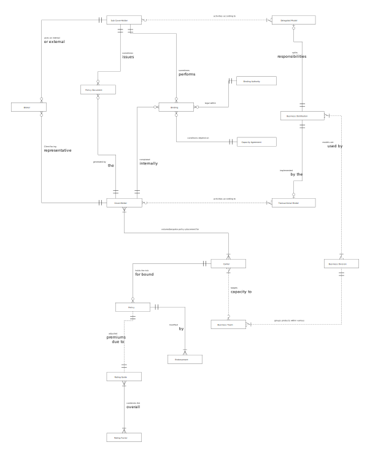

## Insurance Broker view of Underwriting - CDM
The conceptual data model acts as a concept map, describing how a Broker organistaion views and understands Underwriting in the context of its own counterparty relationships and high-level business processes.  

This data model was created using Information Engineering (IE) notation and follows its conventions for relationships and phrases.  
 

 

### Relationship Phrases
Business rules, conditions or objectives can be represented by a conceptual data model. Within this model, relationships can be stated by expansion of the phrases placed on the relationship lines.  
IE notation only expresses single direction phrasing, but a *reverse phrase* has been added for completeness in the table below.  

|From|To|Relationship Description|
|:-|:-|:-|
|Binding | Binding Authority | A Binding is **legal within** an active Binding Authority. *A Binding Authority delegates the Carrier authorisation for Policy Binding*.|
|Binding|Capacity Agreement |Financial Binding **conditions depend on** the terms of the Capacity Agrement. *A Capacity Agreement specifies the finacial limits which allow Binding .* |
|Binding | Cover-Holder | A Policy Binding is **completed internally** by a Cover-Holder.  *A Cover-Holder performs one or more Policy Bindings on behalf of a Carrier.* |
|Broker|Cover-Holder|A Broker is a **client facing representative** of a Cover-Holder. *A Cover-Holder uses an internal or external Broker.*|
|Business Distribution|Business Division|Business Distribution **models are used by** a Business Division. *A Business Division follows one or more Business Distribution Models.*|
|Business Distribution|Transactional Model|Business Distribution can be **implemented by the** Transactional Model. *The Transactional Model includes all responsibliites for Business Distribution.*|
|Business Division|Business Team|A Business Division **groups products within various** Business Teams. *A Business Team provides product epertise for lines of business within a Business Division.*|
|Cover-Holder|Carrier|A Cover-Holder provides **volume/bespoke policy placement for** a Carrier. *A Carrier provides the financial Capacity for use by a Cover-Holder.*|
|Cover-Holder|Transactional Model|A Cover-Holder has administrative **activities according to** the Transactional Model. *The Transactional Model scopes the required business processes for a Cover-Holder.*|
|Carrier|Business Team|A Carrier **targets capacity to** specific Business Teams. *A Business Team writes Policies to meet a Carriers planned targets.*|
|Carrier|Policy|A Carrier **holds the risk for bound** Policies. *A Policy is an Insurance agreement with a Carrier.*|
|Delegated Model|Business Distribution|The Delegated Model defines **split responsibilities** for Business Distribution. *Business Distribution can be implemented by the Delegated Model.*|
|Policy|Endorsement|An in-force Policy can be **modified by** an Endorsement. *An Endorsement is a requested change to the conditions of a Policy.*|
|Policy|Rating Guide|A Policy has **adjusted premiums due to** the Rating Guide. *The Rating Guide assess the Risks of a Policy.*|
|Policy Document|Cover-Holder|A Policy Document is **generated by the** binding Cover-Holder. *A Cover Holder is responsible for issuing the Policy Documents.*|
|Rating Guide|Rating Factor|The Rating Guide **combines the overall** Rating Factors. *A Rating Factor provides a risk score for the Rating Guide.*|
|Sub Cover-Holder | Binding | A Sub Cover-Holder **sometimes performs** Policy Bindings on behalf of the Cover-Holder. *A Binding may result from the actions of a delegated Sub Cover-Holder.* |
|Sub Cover-Holder|Broker|A Sub Cover-Holder **uses an internal or external** Broker. *A Broker is a client facing representative of the Sub Cover-Holder.*|
|Sub Cover-Holder|Delegated Model|A Sub Cover-Holder has administrative **activities according to** the Delegated Model. *The Delegated Model scopes the required business processes for a Sub Cover-Holder.*|
|Sub Cover-Holder|Policy Document|A Sub Cover-Holder **sometimes issues** Policy Documents. *A Policy Document can be generated by the Sub Cover-Holder.*|

### Data Entity Definitions
Descriptions of Data Entities in a conceptual model are essential to provide meaning and context.  
  
|Entity|Meaning|Synonyms|
|:-|:-|-:|
|Binding Authority|A legal agreement between the Carrier and the Cover-Holder, or the Cover-Holder and the Sub Cover-Holder. The authority is specific to circumstances and defines the products, limits, territories, referral criteria, regulations, levels of assumed risk and/or the split between Carriers for any underwritten Policy. The Carrier holds the risk and must pay-out following a valid Claim. The term *"Binding Authority"* is the name given to this agreement where the Carrier is in the London Market.|Facility, Binder|
|Broker|The organisational entity that is present at the point of sale of a Policy.  A Broker can also give advice and should be able to provide appropriate choices for required Coverages. Brokers enter the Policy details into a System or on paper.  They are usually either independant individuals/teams and specialise within a particular Market.|(Sub) Cover-Holder, Consortium|
|Business Distribution|The organisational entity where activities such as Policy Binding, issuing Documentation, and performing Policy administration is accomplished. Business Distribution is either internal to the receiving Cover-Holder (the Transactional Model) or delegated to a third party Sub Cover-Holder (the Delegated Model).||
|Business Division|A grouping of related business teams, usually arbitrary according to the structure of the Broker organisation.  Exmaples are Non-Volume Division: Commercial Combined (property) / Commercial (property) / Real-Estate. Volume Division: Non-Standard Property / High-risk (ccj, convictions, etc). Specialty Division: Latin American plant & machinery / International Liability / US Property / FINPRO.||
|Business Team|A specialist team with a Business Division.  The team can play the role of Underwriter, Cover-Holder and Administrator for lines of business. For example, a FINPRO Business Team will contain Underwriting expertise within the PI (Professional Indemnity) and D&O (Directors and Officers) lines.  A Commercial team may specialise in insurance products for Commerical Properties and a Real-Estate team may do the same for non-Commercial.||
|Capacity Agreement|Occurs between the Carrier and the Underwriter to set financial risk limits for binding Policies. These are specific to the financial capacity of a Carrier, and may exist as a component within other agreements such as a Binding Authority.|Binding Authority|
|Carrier|The legal entity or organisation that holds the Risk (has the Capacity) for an insurance policy.  The Carrier must pay out after a successful Claim.  Each Carrier assesses the performance of the Underwriters through the Loss Ratio.  Bonus values may be paid to Underwriters (Brokers / Cover-Holders) who produce a lower then expected Loss ratio.|Partner, Insurer, Market, Consortium|
|Cover-Holder|The Cover-Holder acts as the agent of the insurance partner (the Carrier), who *"delegates authority"* and responsibility for the underwriting to the Cover-Holder.  Usually, the Cover-Holder provides either the processing volume or market specific expertise to Carriers, who do not have the organisational resources, but do have the financial Capacity. The Cover-Holder may act as an intermediary between the Carrier and the Sub Cover-Holders/Brokers. Usually a Cover-Holder is within an organisation which is also a Broker *and* one or more specialised Sub Cover-Holders.  Therefore, it is often important to understand the internal or external processing responsibilities defined by the Business Distrubution model.|Agent, MGA|
|Delegated Model|The Delegated Business Distribution Model outsources certain business processes to other organisations.  All resulting processes are undertaken by third parties, and information flow must be obtained through the use of the Bordereaux mechanism. Carriers *delegate authority to Cover-Holders, who then delegate authority to Sub Cover-Holders*.  The Sub Cover-Holder Underwriters bind the Policy and issue Documentation.  The Cover-Holder usaully selectively monitors some activities of the Sub Cover-Holder.|MGU Model|
|Endorsement|Any change to an active Policy, including changes to Policy terms, customer details, financial values or payments. Some mid-term adjustments to a Policy may trigger business processes.  Examples are: adjust premium, re-calculate acquisition costs, or re-calculate exposures.|MTA|
|Policy|An agreement for an insurance that is sold to a customer (the Insured) by a Broker, and underwritten by the Cover-Holder.  The Underwriting terms and conditions must meet the criteria of the Binding Authority. Some policies have multiple *sum insured* values as a Policy can encompass many Coverages.|Risk, Cover|
|Policy Document|The official set of Policy Documents detailing the terms and conditions of the Insurance agreement between the Carrier and the Insured.  These must be generated by the Cover-Holder as deemed responsible by the Business Distribution Model.  Where possible, documents are always electronic. ||
|Rating Factor|Each insurance product will have a structured assessment of its risks.  For example, life assurance has rating factors of age, health and occupation.  General insurance Rating Factors always depend on the insured entity. A sliding scale within Actuarial tables is used to generate the applicable rating factors for each risk.  The value of a rating factor is numeric, indicating a positive or negative adjustment within the overall Rating Guide.||
|Rating Guide|Created through the combination and interpretation of Rating Factors, the guide is used by the Cover-Holder to assess the amount of Policy Premiums that are charged to the Insured.  If the guide indicates higher risk then Premiums will be adjusted upwards.||
|Sub Cover-Holder|The customer facing counterparty who sells products. This may be a high-street Broker, a national Broker or a group sales division within an organisation.  A Sub Cover-Holder *"takes the product to market"*.  If the Sub Cover-Holder is a Broker then they will have access to multiple markets so as to provide options and choices. The Sub Cover-Holder obtains quotes which may turn into a sale (new business) if taken up.  That product is *"written"* by the insurance process known as Binding.|Broker, Sub-Agent|
|Transactional Model|The Transactional Business Distribution Model retains all business processes internally within the parent organisation.  All resulting processing and information flow are retained within internal systems. Carriers *delegate authority to the Cover-Holders*, who utilse their own Underwriting teams to perform Policy Binding and issue Documentation.|MGA Model|
