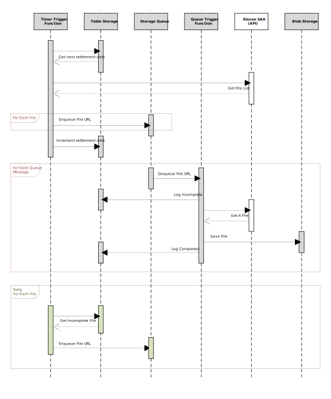

## S0142 Settlement Data - File Acquisition
### Overview  
All UK power (a.k.a. electricity) generation and consumption operates within a regulated industry.  Companies which Generate usually sell power to Suppliers, who in turn sell power to all Consumers (households or other companies).  

The majority of selling & purchasing is undertaken in advance of actual generation, and can be undertaken up to 1 hour before the actual generation period (known as a settlement period).  Currently a settlement period is 30 minutes in duration (although this may change to 15 minutes to align with Europe at some point in the future).

Because power must be generated and consumed simultaneously in real-time via the grid, the actual MWh purchased and sold may fluctuate from the numbers used in the prior sales and purchase agreemenents.  The process known as Balancing and Settlement can only be executed as a backwards-looking activity in order to give time for the actual generation and consumption figures to be gathered (meter readings of various types) and sent to the Elexon settlement IT system.  This system, known as the SAA (Settlement Administration Agent) then produces data outputs which provides accurate MWh values to enable correct financial settlement between energy market participants.  

 

### Requirements 
Acquire the S0142 data files.    
In BSC (Balancing and Settlement Code) parlance, these files are the SAA-I014 Settlement Administration Agent, Interface 14, sub-flows 1 & 2.  Or more commonly called the *settlement report*.  The S0142 files are generated daily, for a number of differing Settlement run types.  They are generated as multi-record format data files and made availiable via an API.

The Elexon SAA has 2 Data APIs:
- Daily File List GET
- Single named File GET

 

| # | Functional Requirement |
|:-------------|:--------------|
| FR-1 | Retrieve the daily S0142 files from the Elexon SAA API. |
| FR-2 | Do not ingest duplicate files. |
| FR-3 | Maintain a viewable log of the files that have been ingested. |
| FR-4 | Retain the following information within the file names:   Settlement Date / Settlement Run Type / SAA Run Date. |

| # | Non-Functional Requirement |
|:-------------|:--------------|
| NFR-1 | Only use Serverless infrastructure to allow hosting in public cloud environments.|
| NFR-2 | Any failure in execution or API communication should be automatically recovered/retried to avoid the need for manual intervention. |
| NFR-3 | Execution and Storage costs should be minimised, therefore process duplication & complexity constraints may be relaxed. |
| NFR-4 | Duplicate files should not be created and stored. |
| NFR-5 | There are no performance demands, apart from those imposed by Serverless HTTP timeouts. |  

 

### Logical Design  
Being agnostic of any technology or design patterns, the logical design is represented by the layers in the following diagram:  

The Data Acquisition layer provides the orchestration required to meet FR-1 thru FR-4.  

 

### Azure Component Design
This component design is just one of the many ways of implementing the Logical Design.   
NFR-1 and NFR-3 wil be met by using an Azure Function App, which has a free (low-cost) tier and which can automatically integrate into other Azure components such as an inexpensive Storage Account that incorporates blob storage (files), table storage (key-value pair DB), and message Queueing features.  

 

A timer trigger will be used as the mechanism to initiate the daily ingestion process.  
The table storage which is a suitable configuration store, will be used to contain the settlement date for querying the File List API.  Once the file list is known, the Function will create and Queue messages for every file to be retrieved.  To meet NFR-5, each queued message will then trigger a Function which will retrieve that individual file.  Calling a Function per file is an attempt to mitigate both Function App and HTTP timeouts.  
  
To meet NFR-2, if a file load process does not complete, this should be apparent from the condition of the table configuration entries.  In this case, the retry timer triggered Function will manage re-queueing of failed files. 

To meet NFR-4, the queue trigger Function should abort any process which tries to update the configuration record of a completed file. 
  
Serially enqueued messages for a collection of files should always be given an incrementing visibility timeout, which will negate Azure's attempts to run parallel functions.  This will ensure cost control for NFR-3 by avoiding more sophisticated and costly Function App configuration options.  In addition, the TTL (time to live) of enqueued messages should be set to non-expiry, which will guarantee messages only expire on dequeue operations.  

 

### Sequence
The following UML sequence diagram provides an overview of steps required within this design.  It also shows that the Timer and Queue Functions contain the majority of activity, and hence the focus of the development effort will be in these components.  It also indicates that Table Storage is most frequenty accessed, and therefore the design of the table record keys should be carefully considered to efficiently meet all processing needs.  

.firstcol table {
    th:first-of-type {
        width: 20%;
    }
    th:nth-of-type(2) {
        width: 80%;
    }
}

